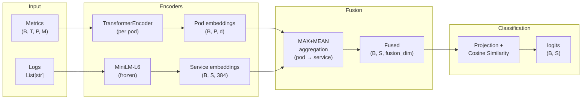

# Lemzha-k: Multimodal Root Cause Analysis for Kubernetes

Multimodal deep learning model for **Root Cause Analysis (RCA)** in Kubernetes microservice environments. Combines time-series metrics and log text to identify the faulty service after a fault injection.

## Architecture



**Key design decisions:**
- **TransformerEncoder** encodes per-pod metric time series with positional encoding and masked average pooling
- **MiniLM-L6** (frozen) encodes log texts and service names into a shared semantic space
- **Fusion** aggregates pod-level metric embeddings to service-level via MAX+MEAN pooling using the pod-to-service mapping
- **Similarity-based classification** uses cosine similarity between fused embeddings and service name embeddings, enabling generalization to unseen service sets without retraining

## Dataset

**101 scenarios** from two public Kubernetes fault injection datasets:

| Source | Scenarios | Apps | Duration | Fault Types |
|--------|-----------|------|----------|-------------|
| [Nezha](https://github.com/IntelligentDDS/Nezha) | 97 | OnlineBoutique, TrainTicket | ~10 min each | cpu_contention, cpu_consumed, network_delay, exception, return |
| [LEMMA-RCA](https://huggingface.co/datasets/Lemma-RCA-NEC/Cloud_Computing_Preprocessed) | 4 | Custom microservices | 22-46 hrs each | CPU stress, pod migration, malware, network issue |

Each scenario contains:
- **Metrics**: Up to 19 time-series per pod (CPU, memory, network, latency, workload, etc.), aligned to 30s bins
- **Logs**: Service-level text aggregated in 30s windows, cleaned with regex normalization
- **Ground truth**: Root cause service + fault timestamp

## Pipeline

```
Step 1 ─ Convert         Step 2 ─ Transform         Step 3 ─ Validate
LEMMA ZIPs ──────► metrics_data/ ──────► core_metrics_tmp/  ──────► Quality
Nezha CSVs         log_data/             core_logs_tmp/              reports
                                         core_multimodal_tmp/        (A/B/C/D)

Step 4 ─ Train                    Step 5 ─ Evaluate
best_hyperparams.json ──────►     LODOCV (Leave-One-Day-Out)
Optuna search (50 trials)         4 folds, zero temporal overlap
```

| # | Notebook | Purpose |
|---|----------|---------|
| 1 | `01-Convert-Scenarios/Convert-LemmaRCA-Scenarios.ipynb` | Extract and reorganize LEMMA ZIPs into unified folder structure |
| 2a | `02-Transform-Data/Transform-Data-Lemma.ipynb` | Align LEMMA metrics to 30s grid, crop 45-min fault window, aggregate logs |
| 2b | `02-Transform-Data/Transform-Data-Nezha.ipynb` | Parse Nezha faults, resample metrics, extract logs per scenario |
| 3 | `03-Data-Validation/unified_rca_data_validation.ipynb` | Validate structural coherence, temporal alignment, classify scenarios A/B/C/D |
| 4 | `04-Train/train_multimodal_rca.ipynb` | Train multimodal model with full architecture, augmentation, ONNX export |
| 5 | `04-Train/optuna_hyperparam_search.ipynb` | Bayesian hyperparameter optimization (50 trials, TPE sampler, median pruning) |
| 6 | `04-Train/05-LODOCV.ipynb` | Leave-One-Day-Out Cross-Validation on Nezha (publication-ready evaluation) |

## Setup

### 1. Clone and install dependencies

```bash
git clone https://github.com/<your-user>/lemm.git
cd lemm
uv sync
```

> Requires Python >= 3.12. Uses [uv](https://docs.astral.sh/uv/) for dependency management. GPU with CUDA recommended.

### 2. Processed data (included)

The processed data needed for training is **included in the repo** (~61 MB, 98 scenarios):

| Directory | Contents | Size |
|-----------|----------|------|
| `core_metrics_tmp/` | Aligned metric parquets (up to 19 per scenario) | 50 MB |
| `core_logs_tmp/` | Service-level log parquets | 11 MB |
| `core_multimodal_tmp/` | manifest.json + ground_truth.json per scenario | 1.4 MB |

You can start training immediately — no raw data download needed.

### 3. Run the pipeline

```bash
# Train the model
jupyter notebook notebooks/04-Train/train_multimodal_rca.ipynb

# Evaluate with LODOCV
jupyter notebook notebooks/04-Train/05-LODOCV.ipynb

# Hyperparameter search (optional)
jupyter notebook notebooks/04-Train/optuna_hyperparam_search.ipynb
```

<details>
<summary>Regenerating processed data from raw sources (optional)</summary>

Download raw datasets (~7 GB total):

| Dataset | Size | Download | Place in |
|---------|------|----------|----------|
| **Nezha** | ~2.9 GB | [GitHub](https://github.com/IntelligentDDS/Nezha) | `Nezha/rca_data/` |
| **LEMMA-RCA** | ~75 GB | [HuggingFace](https://huggingface.co/datasets/Lemma-RCA-NEC/Cloud_Computing_Preprocessed) | `Cloud_Computing_Preprocessed/` |

Then run notebooks in order:

```bash
# Step 1: Convert LEMMA (only if using LEMMA data)
jupyter notebook notebooks/01-Convert-Scenarios/Convert-LemmaRCA-Scenarios.ipynb

# Step 2: Transform to unified format
jupyter notebook notebooks/02-Transform-Data/Transform-Data-Nezha.ipynb
jupyter notebook notebooks/02-Transform-Data/Transform-Data-Lemma.ipynb  # optional

# Step 3: Validate
jupyter notebook notebooks/03-Data-Validation/unified_rca_data_validation.ipynb
```

</details>

### Data directories

| Directory | In repo? | Contents |
|-----------|----------|----------|
| `core_metrics_tmp/` | **yes** | Aligned metric parquets per scenario |
| `core_logs_tmp/` | **yes** | Service-level log parquets per scenario |
| `core_multimodal_tmp/` | **yes** | manifest.json + ground_truth.json per scenario |
| `metrics_data/`, `log_data/` | no | Intermediate LEMMA conversion (gitignored) |
| `Nezha/`, `Cloud_Computing_Preprocessed/` | no | Raw datasets (gitignored) |

## Model Configuration

Best hyperparameters found via Optuna (stored in `best_hyperparams.json`):

| Parameter | Value | Description |
|-----------|-------|-------------|
| `d_model` | 64 | Transformer hidden dimension |
| `n_heads` | 4 | Attention heads |
| `n_layers` | 3 | Transformer layers |
| `fusion_dim` | 256 | Fusion output dimension |
| `lr` | 3.48e-4 | Learning rate |
| `batch_size` | 8 | Batch size |
| `dropout` | 0.271 | Dropout rate |
| `temperature` | 0.112 | Cosine similarity temperature |
| `label_smoothing` | 0.011 | Label smoothing factor |
| `warmup_epochs` | 6 | Linear warmup epochs |

## Key Implementation Details

- **Positional bias mitigation**: Service order is randomized during training to prevent the model from learning index-based shortcuts
- **Type-aware normalization**: Different normalization strategies per metric type (Min-Max for percentages, Log1p+Z-score for bytes, Z-score for latency/counts)
- **3D masking**: Per-metric validity mask `(T, P, M)` handles partially missing metrics across heterogeneous datasets
- **Dynamic metric count**: Supports variable number of metrics per scenario (7 core for LEMMA, up to 19 for Nezha) via `manifest.json`
- **ONNX export**: Full architecture exportable for visualization with [Netron](https://netron.app/) (last cell of `train_multimodal_rca.ipynb`)

## Results (LODOCV)

Leave-One-Day-Out Cross-Validation on Nezha (4 folds):

| Metric | Mean | Std |
|--------|------|-----|
| Acc@1 | 0.418 | 0.150 |
| Acc@3 | 0.607 | 0.161 |
| MRR | 0.560 | 0.129 |

## Project Structure

```
lemm/
├── README.md                  # This file
├── pyproject.toml             # Dependencies (uv)
├── uv.lock                    # Lockfile
├── best_hyperparams.json      # Optimized hyperparameters
├── .gitignore
├── paper/
│   └── main.tex               # LaTeX paper
└── notebooks/
    ├── 01-Convert-Scenarios/  # LEMMA data conversion
    ├── 02-Transform-Data/     # Unified format transformation
    ├── 03-Data-Validation/    # Quality validation
    └── 04-Train/              # Training, Optuna, LODOCV, ONNX
```

## References

- **Nezha**: Yu et al., "Nezha: Interpretable Fine-Grained Root Causes Analysis for Microservices on Multi-Modal Observability Data", FSE 2023. [GitHub](https://github.com/IntelligentDDS/Nezha)
- **LEMMA-RCA**: Zheng et al., "LEMMA-RCA: A Large Multi-modal Multi-domain Dataset for Root Cause Analysis", 2024. [HuggingFace](https://huggingface.co/datasets/Lemma-RCA-NEC/Cloud_Computing_Preprocessed)